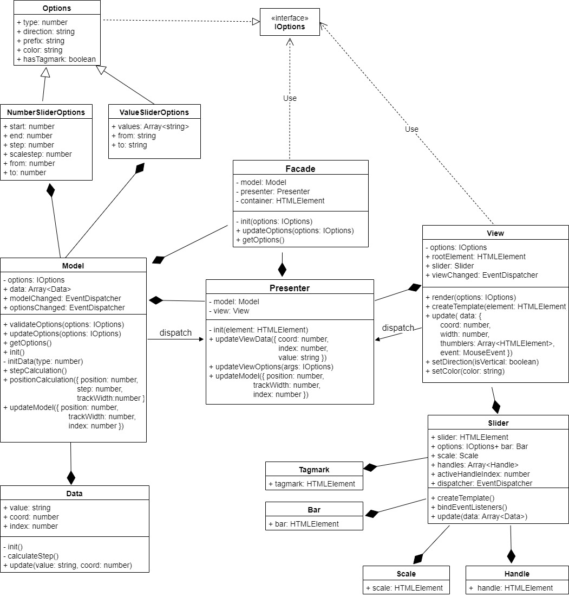

# PerfectSlider

Слайдер, плагин для jQuery

## Demo
[Demo page](https://yubil-olga.github.io/Range/)

## Архитектура приложения

**View** - отвечает за внешнее представление слайдера, отрисовывает его в Dom. Пользователь взаимодействует непосредственно с View с помощью событий мыши. Как только произошло указанное событие, Presenter получает уведомление (inputChanged).

**Model** - хранит данные о выбранных значениях(_data). Может получить команду от презентера, что данные необходимо пересчитать(valueCalculation). Пересчитывает, обновляет _data и отчитывается перед презентером: modelChanged.

**Presenter** - посредник между View и Model. Слушает события: если inputChanged, вызывает метод модели valueCalculation и передает необходимые для расчета данные. Если modelChanged, то вызывает метод вида слайдера update и передает ему значения и координаты для перерисовки.

## UML диаграмма


## Использование

### Установка

1. **git clone** https://github.com/Yubil-Olga/Range - клонировать репозитрорий
2. **npm install** - установить зависимости
3. **npm run build** - запустить сборку
4. **npm test** - запуск тестов

### Инициализация

```
<div class='myElement'></div>
```
```javascript
$(".myElement").perfectSlider()
```

#### Подключение опций:
```javascript
$('.myElement').slider({
	type: 'double',
    direction: 'vertical',
    values: ['one', 'two', 'three']
});
```


### Настройки
| Option        | Defaults      | Type   | Description                                                                     |
| ------------- |:-------------:|:------:|---------------------------------------------------------------------------------|
| direction     | horizintal    | string | Choose slider direction, could be horizontal or vertical                        |
| type          | single        | string | Choose slider type, could be single - for one handle, or double for two handles |
| start         | 0             | number | Set slider minimum value
| end           | 100           | number | Set slider maximum value
| step          | 1             | number | Set sliders step
| scalestep     | -             | number | Creates scale of the slider, set step of scale
| prefix        | -             | string | Set prefix for values
| color         | #53b6a8       | string | Set actve color, could be gradient
| tagmark       | true          | boolean| Set tagmark
| values        | []            | array  | Set your own array of possible slider values. They should be strings.   

